# Flipkart E-Commerce Analytics

An exploratory data analysis project focused on understanding **e-commerce product performance, pricing, ratings, reviews, categories, and customer engagement** using Python and SQL.

---

## Overview

This project analyzes Flipkart product data to identify patterns and relationships across products, categories, prices, ratings, reviews, and other available attributes.

The analysis combines **Python-based exploratory analysis, SQL querying, and data visualization** to turn raw e-commerce data into meaningful insights.

## Objectives

* Analyze product and category performance
* Explore pricing and discount patterns
* Examine product ratings and reviews
* Identify patterns in customer engagement
* Compare products and categories
* Generate data-driven business insights

## Tech Stack

* **Python** — Pandas, NumPy
* **Visualization** — Matplotlib, Seaborn
* **SQL** — MySQL / PostgreSQL
* **Analysis** — Exploratory Data Analysis (EDA)

---

## Analysis Workflow

```text
Raw Data
   ↓
Data Cleaning
   ↓
Exploratory Data Analysis
   ↓
SQL Analysis
   ↓
Data Visualization
   ↓
Insights
```

---

## Visual Gallery

The project contains **14 visualizations** covering different aspects of the Flipkart dataset.

<div align="center">

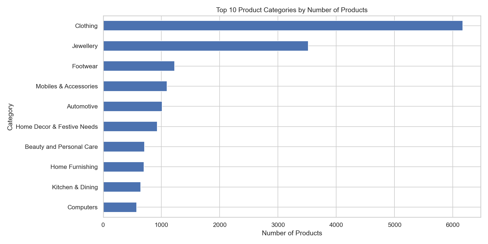

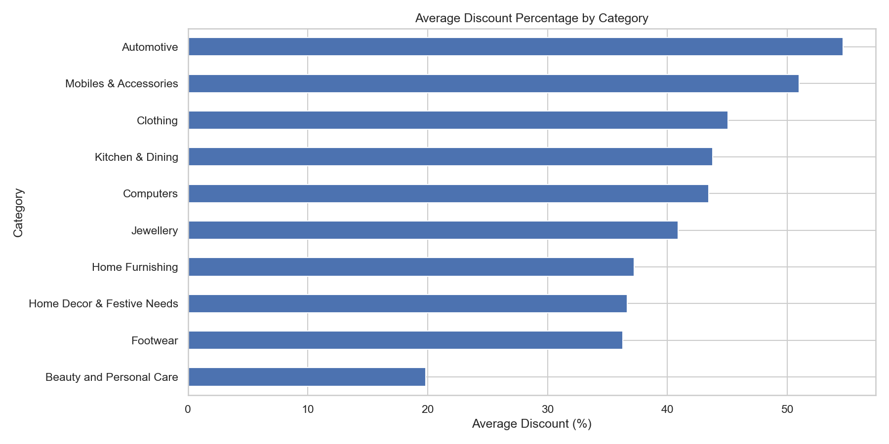

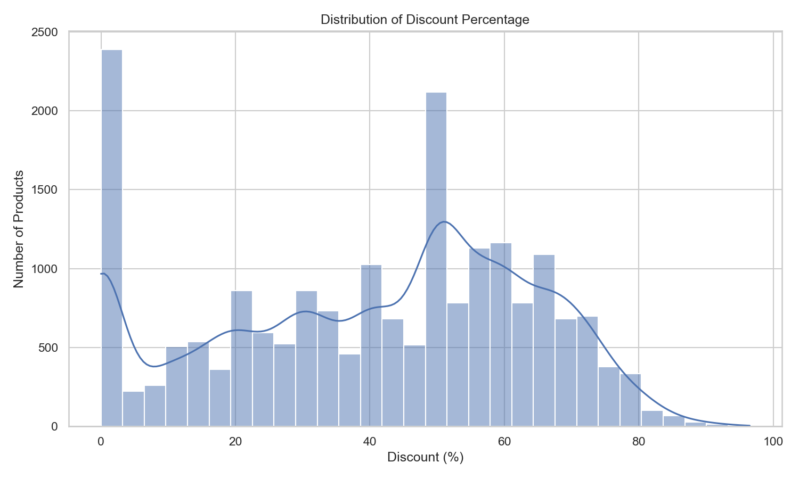

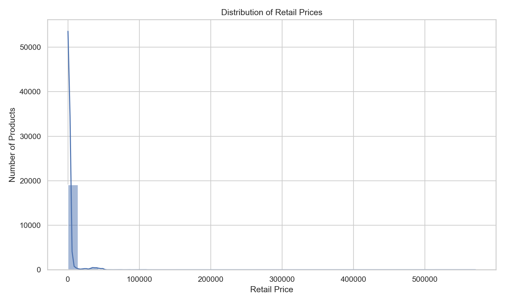

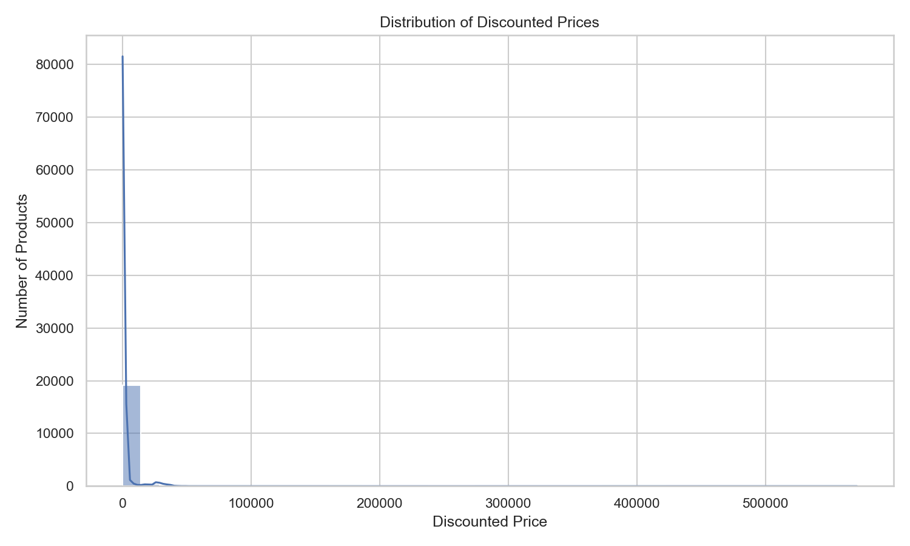

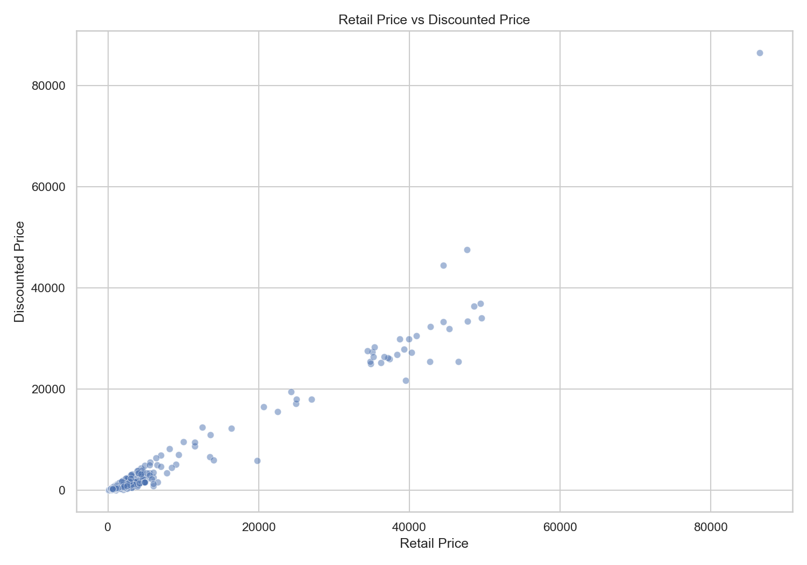

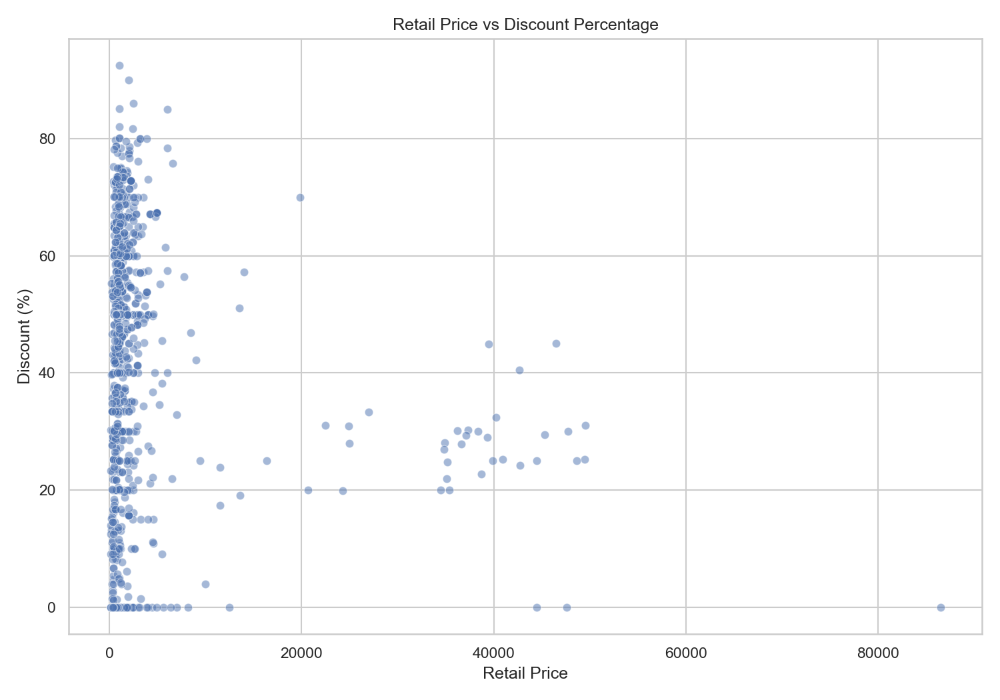

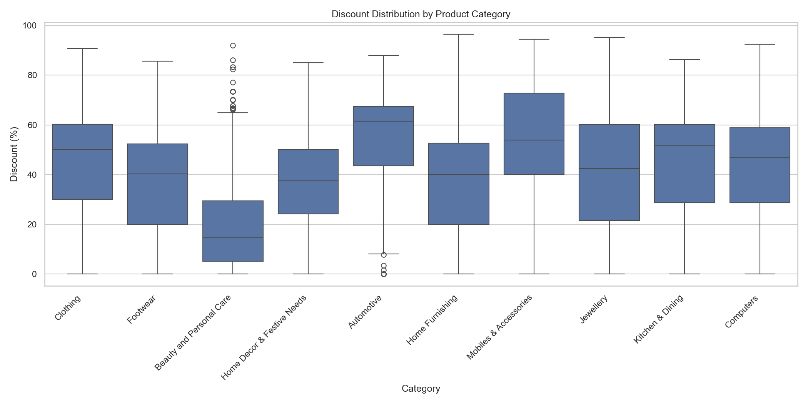

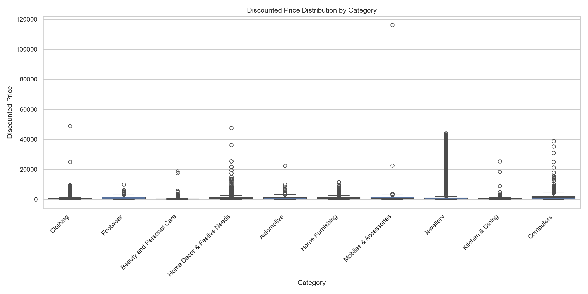

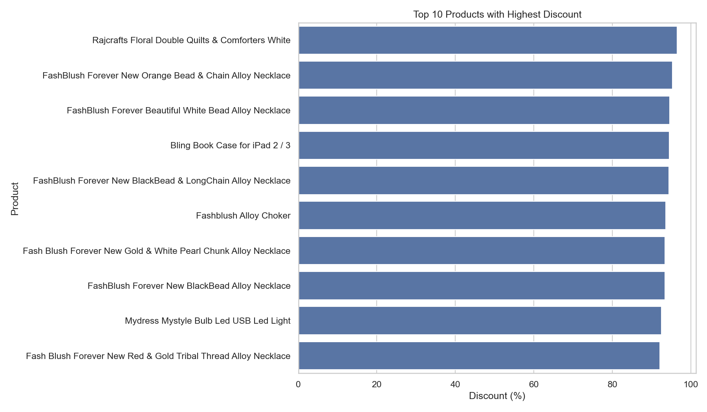

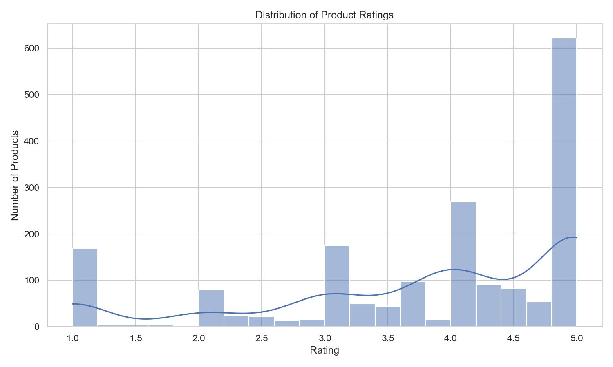

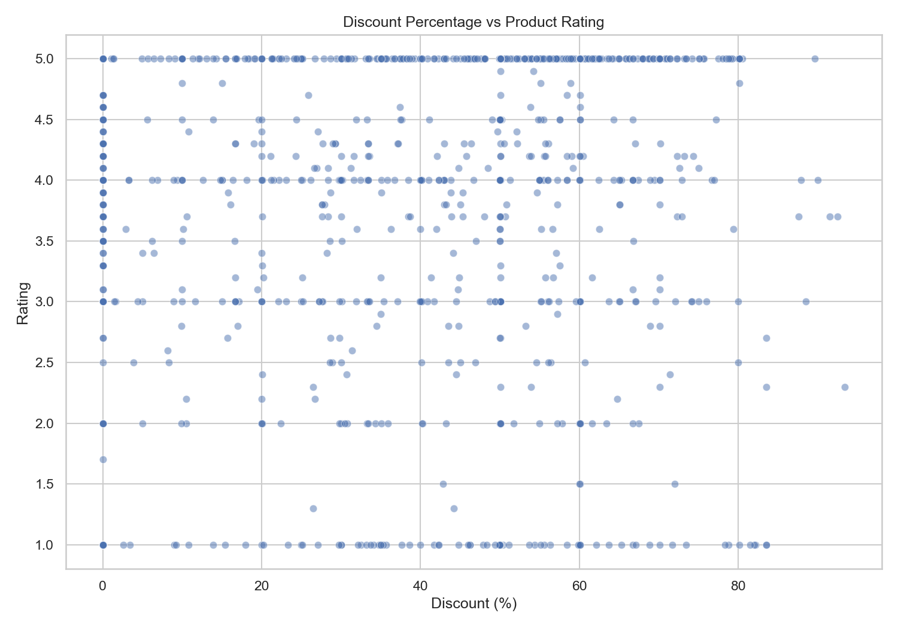

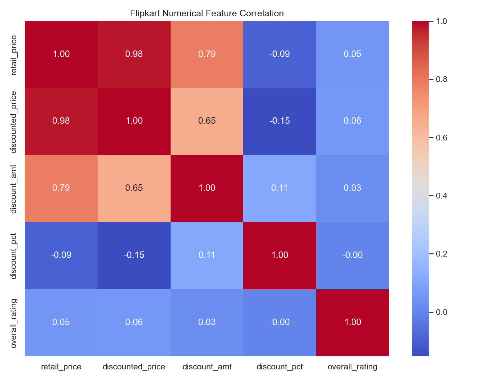

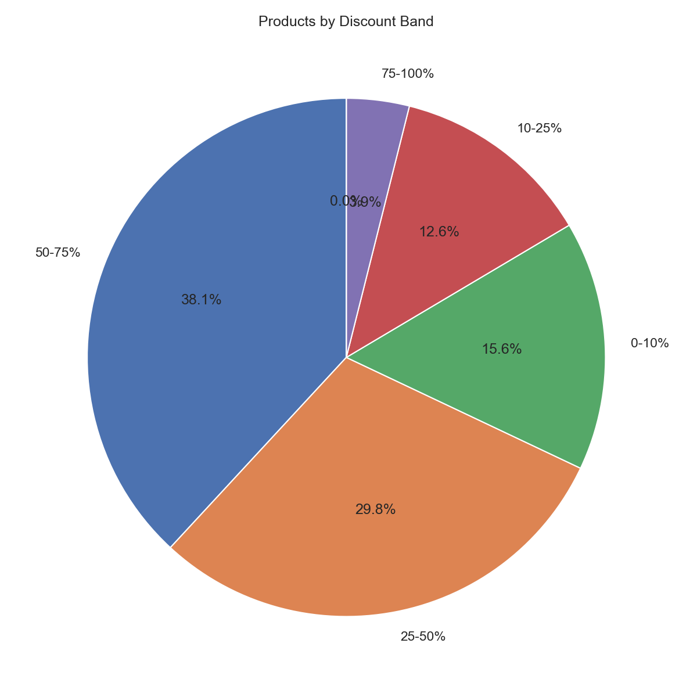

</div>

---

## SQL Analysis

SQL queries used for the analysis are available in:

```text
queries.sql
```

The dataset can be loaded into **MySQL or PostgreSQL** and the queries can then be executed against the imported table.

---

## Run

Install the required Python packages:

```bash
pip install pandas numpy matplotlib seaborn
```

Run the analysis:

```bash
cd flipkart
python analysis.py
```

## Focus Areas

**Product Performance · Category Analysis · Pricing · Ratings · Reviews · Discounts · Customer Engagement**

---

## Dataset

The analysis uses the CSV dataset included in this project:

```text
flipkart.csv
```

---

## Key Takeaway

The project demonstrates an end-to-end workflow for analyzing e-commerce data — from **data preparation and SQL analysis to visualization and insight generation**.
