# IPL Data Analytics

## Overview

An analytical exploration of IPL match and player data covering team performance, player statistics, batting, bowling, match outcomes, toss decisions, venues, and season-level trends.

The project uses Python and SQL to analyze structured cricket data and communicate findings through visualization.

## Objectives

* Analyze team and player performance
* Explore batting and bowling statistics
* Examine match outcomes and winning patterns
* Analyze toss decisions and outcomes
* Explore venue and season-level trends
* Compare team and player performance

## Tech Stack

* **Python** — Pandas, NumPy
* **Visualization** — Matplotlib, Seaborn
* **Database** — MySQL / PostgreSQL
* **Analysis** — Exploratory Data Analysis & SQL

## Methodology

```text
Match & Player Data
        │
        ▼
Data Cleaning & Preparation
        │
        ▼
Exploratory Data Analysis
        │
        ▼
SQL Analysis
        │
        ▼
Visualization
        │
        ▼
Performance Insights
```

## Visual Gallery

The analysis includes **15 visualizations** covering team, player, match, and performance-level analysis.

<div align="center">

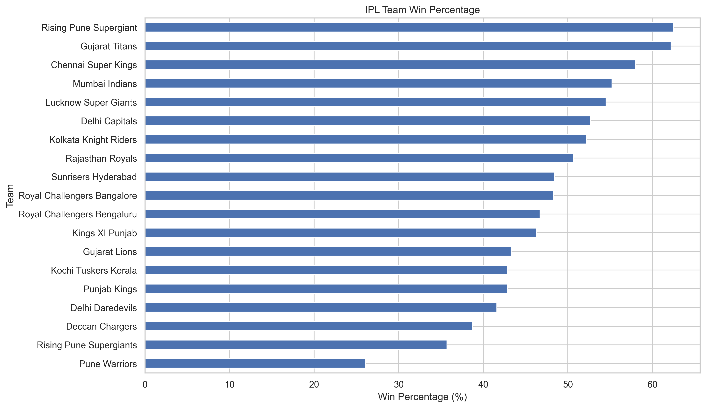

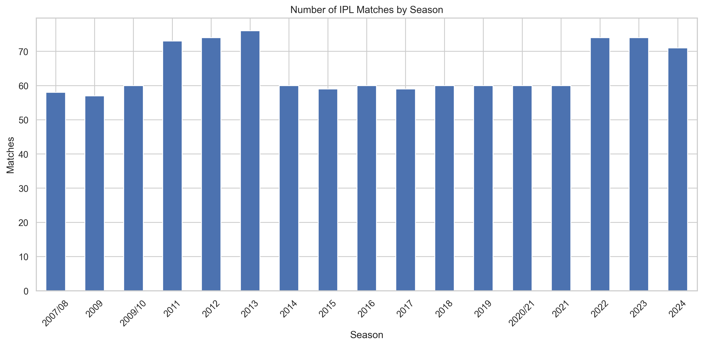

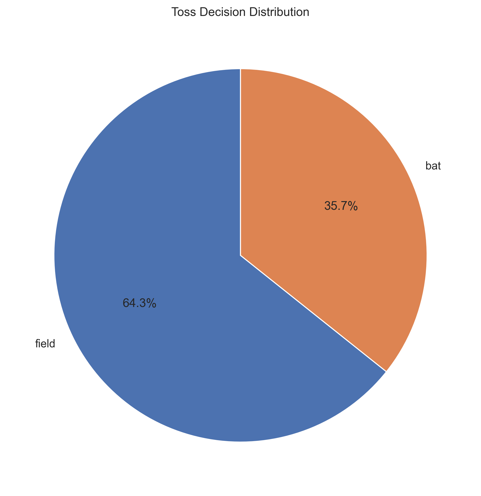

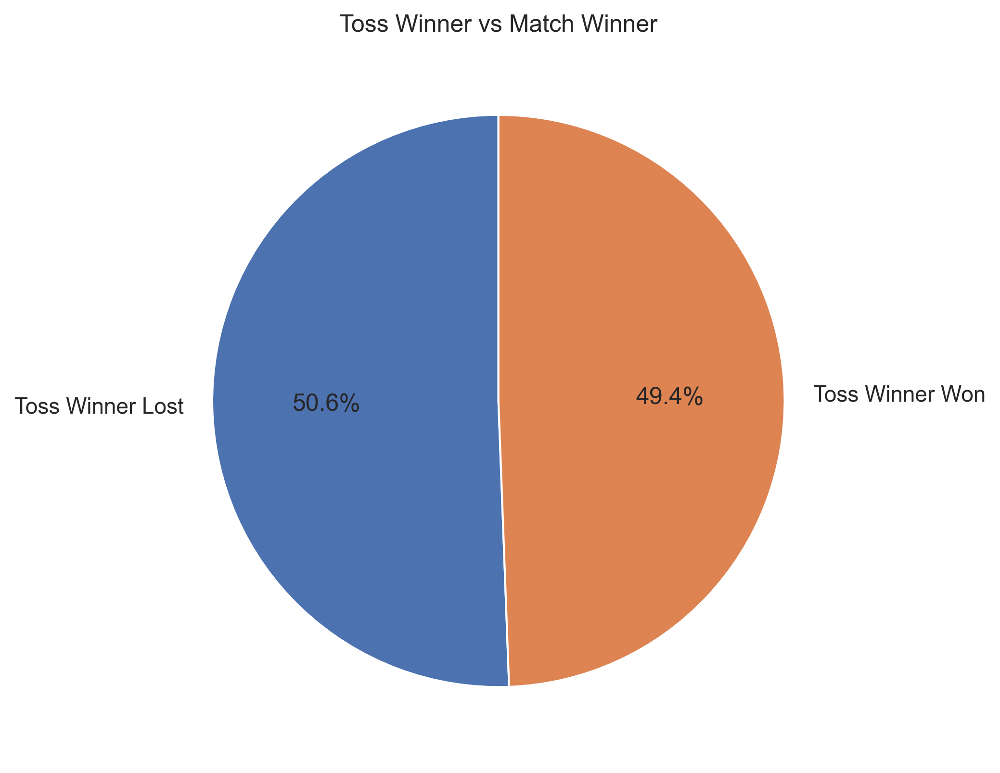

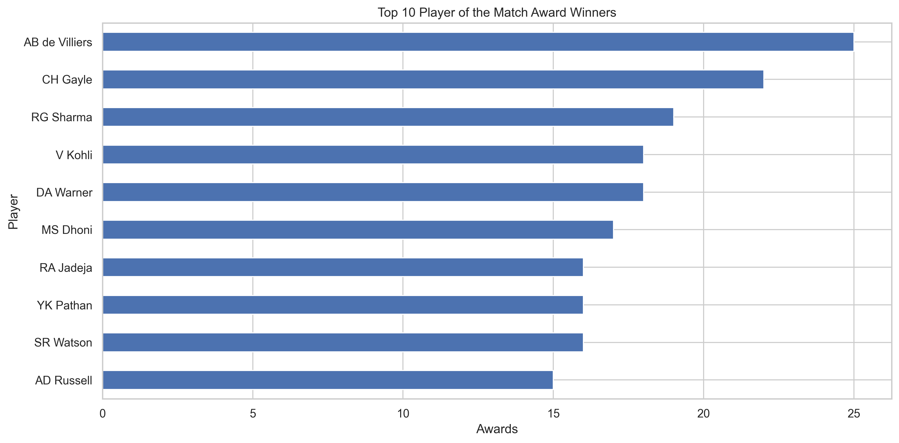

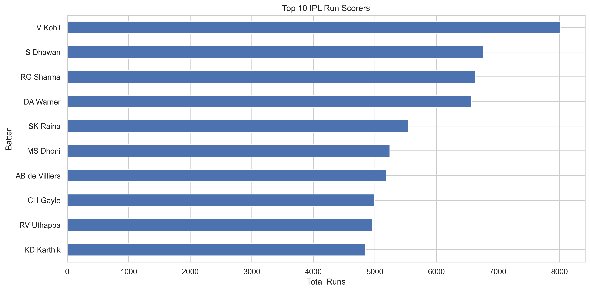

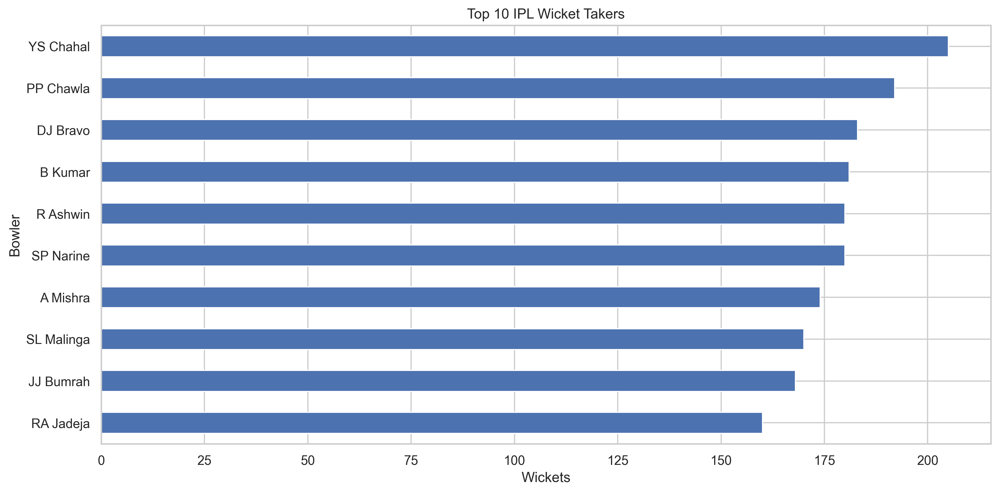

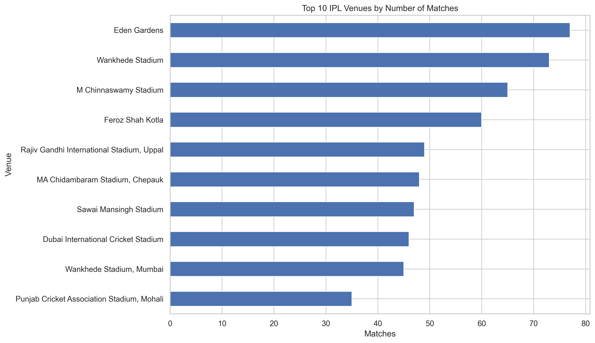

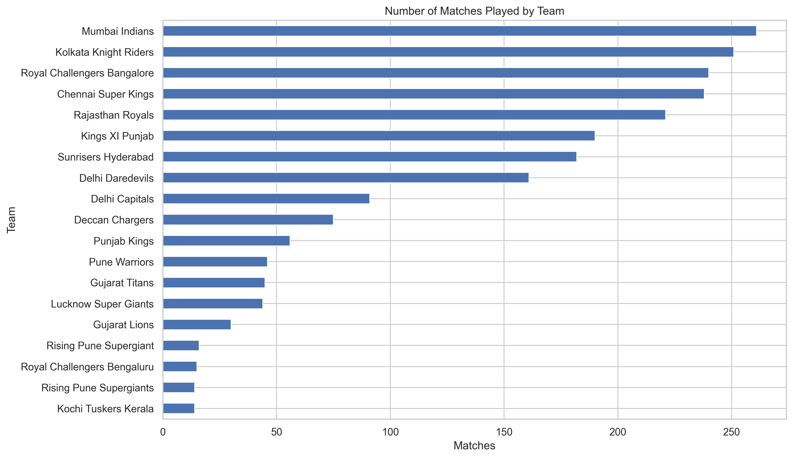

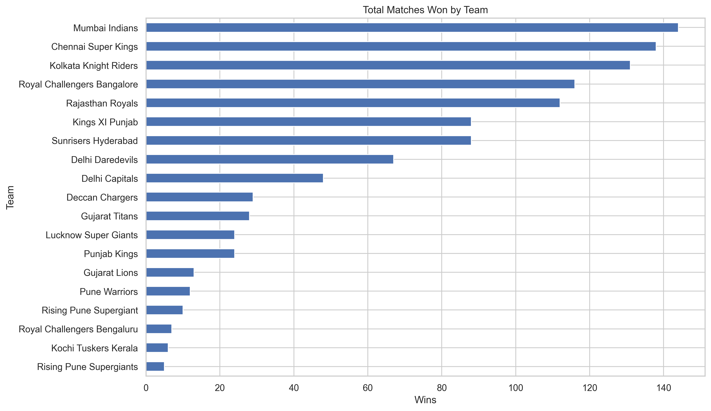

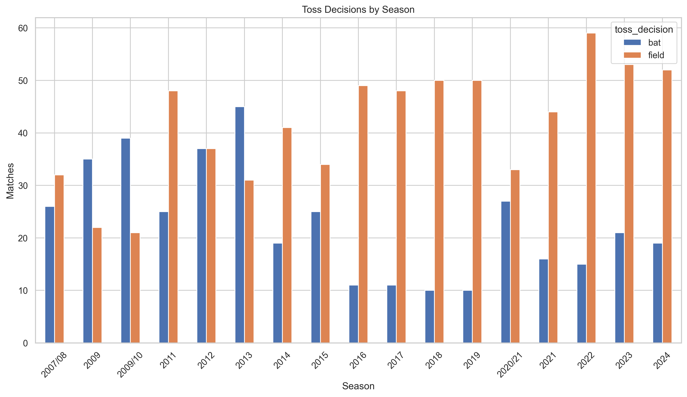

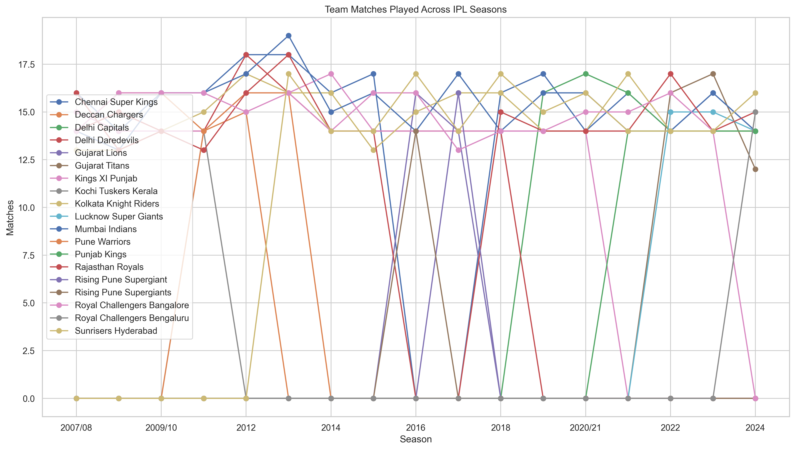

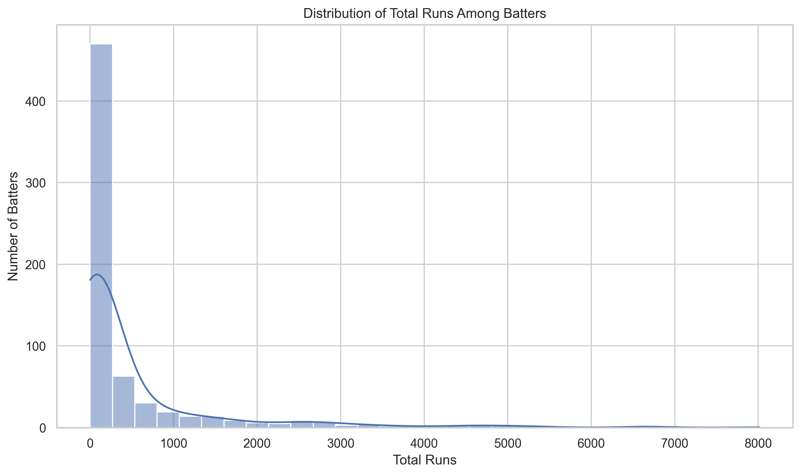

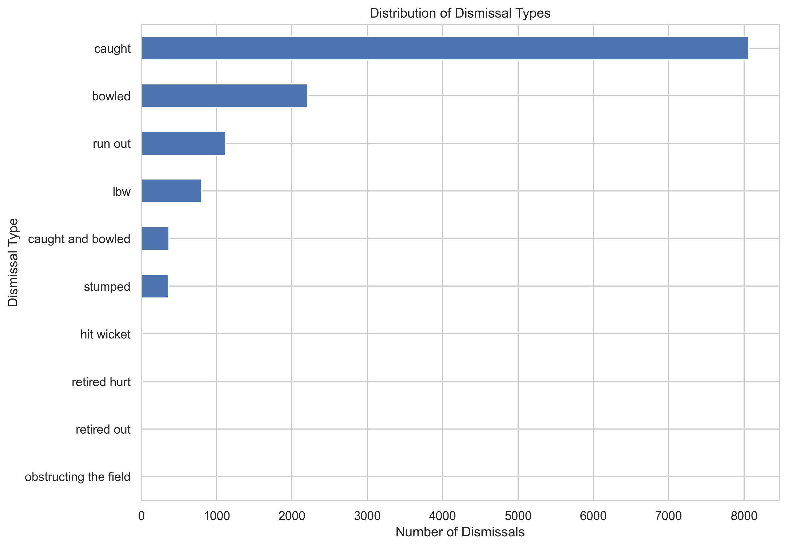

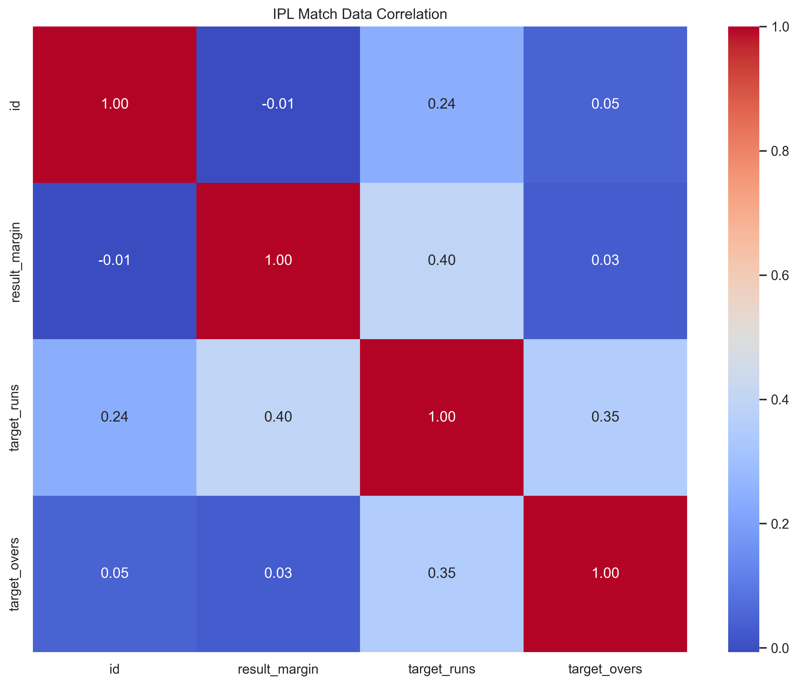

</div>

## SQL Analysis

SQL queries are available in `queries.sql`.

Load the IPL CSV datasets into MySQL or PostgreSQL and execute the queries.

## Run

Install the required Python packages:

```bash
pip install pandas numpy matplotlib seaborn
```

Run the analysis:

```bash
cd ipl
python analysis.py
```

## Focus Areas

**Team Performance · Player Statistics · Batting · Bowling · Match Outcomes · Toss Analysis · Venue Analysis · Season Trends**
